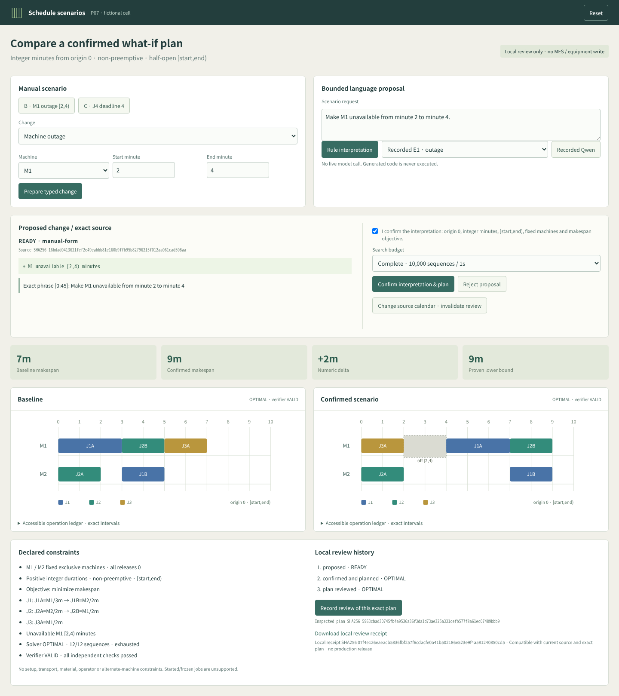

# Production schedule scenario review


[Editable architecture SVG](docs/architecture.svg) · [Asset provenance](docs/asset-provenance.md)

A small production-planning review desk for a **fictional two-machine cell**. A bounded language proposal or manual form prepares a typed change. A person confirms its meaning and half-open minute convention; an actually executed exact planner then produces a schedule. An independently implemented verifier checks the operations. A separate human action records review of the exact proposal and exact plan.

The interface uses compact controls, a proposed-change diff, two Gantts on the **same relative-minute scale**, explicit downtime bands, numeric deltas, solver proof state, independent checks and a review history. Original operations are accessible in a keyboard-focusable SVG and an operation ledger. The form works without any model service.



[Actual browser demonstration MP4](artifacts/media/scenario-review.mp4) · [390px screenshot](artifacts/media/mobile-390.png) · [Browser checks](artifacts/browser-checks.json)

## Run locally

Node 18 or later; no npm packages, solver installation, vector database or calendar widget is required.

```sh
npm test
npm start
```

Open `http://127.0.0.1:5077`. State is in memory and resets when the process restarts. The optional Python client requires Linux and the existing local Ollama runtime; it is not part of normal UI use. [Runbook](docs/runbook.md) describes its shared lease and timeout barrier. CPU tests mock inference and make no model requests.

## Original scheduling slice and actual outcomes

All releases are 0, the origin is 0, units are integer minutes, machines M1/M2 are fixed and exclusive, operations have positive durations and cannot be preempted, and intervals are **[start,end)**. The objective minimizes makespan. There are no setup, transport, material, operator or alternate-machine constraints. Existing started/frozen jobs are unsupported.

| Scenario | Change | Actual solver / verifier | Makespan | Proof |
|---|---|---|---:|---|
| A | J1A M1/3 → J1B M2/2; J2A M2/2 → J2B M1/2; J3A M1/2 | OPTIMAL / VALID | 7 | M1 workload 7; all 12 machine-order combinations examined |
| B | M1 unavailable [2,4) | OPTIMAL / VALID | 9 | Workload plus calendar lower bound 9; all 12 combinations examined |
| C | J4A M2/1 → J4B M1/1; explicit hard completion deadline 4 | OPTIMAL / VALID | 8 | M1 workload 8; all 144 combinations examined |
| A, horizon 6 | Completion required within 6 | INFEASIBLE / NOT_RUN | — | M1 load 7 exceeds horizon |
| A, one sequence | Deliberately incomplete search | UNKNOWN / VALID | 11 incumbent | Feasible incumbent is not an optimum proof |
| A, zero time budget | Deliberately incomplete search | UNKNOWN / NOT_RUN | — | No incumbent; no infeasibility claim |

[Six actual planner invocations](artifacts/planner-executions.json) are produced by `node plan-evidence.mjs`; they do not read the gold at runtime. [Frozen handwritten mathematical gold](gold.json) was committed before model prompts at `a188c88`. Another valid seven-minute base schedule is accepted; the UI need not duplicate the gold's particular machine order.

`planner.mjs` enumerates the operation order on each machine, combines those orders with job-precedence edges, rejects cycles, and places each operation at its earliest calendar-compatible time. Under the declared fixed-machine assumptions, every feasible schedule induces a machine order and moving operations earlier for that order cannot harm makespan or upper completion deadlines. Exhausting all such orders therefore establishes completeness. The search budget is at most 10,000 combinations and 1 second by default, with at most 12 operations. Incomplete enumeration returns UNKNOWN even with a feasible incumbent. Invalid schema, missing duration and unknown machine return INVALID rather than INFEASIBLE.

`verifier.mjs` does not import the planner or gold. It recomputes exactly-once required-operation coverage, IDs, durations, fixed-machine assignment, releases, job precedence, machine overlaps, downtime, hard deadlines and reported makespan. Omitting J3 fails even if the remaining operations do not overlap. Solver termination, independent feasibility checks and human review are separate states.

## Interpretation and decision boundaries

Only typed `add_outage` and explicit `add_job` J4 changes are allowed. Each carries exact phrase spans, IDs, unit/origin and the source scenario fingerprint. The bounded rule parser is intentionally a small grammar, not general natural-language understanding. It rechecks model proposals against exact explicit facts in that grammar. Unsupported residue cannot silently disappear.

- “Urgent” alone has no deadline. Missing duration/deadline requires clarification.
- Unknown machine aliases, ambiguous “don't move J2”, color-order clauses, lateness objectives, supplier instructions, generated code and started/frozen jobs cannot be confirmed.
- Exact multiples of 60 seconds may convert to integer minutes; other seconds require clarification. Both endpoint units are checked independently.
- Confirmation binds the displayed proposal ID, full proposal hash and source fingerprint. Replacements or calendar changes return stale inspection errors.
- The review action binds the confirmed proposal and exact plan fingerprint, including solver proof and verifier result. A new search budget creates a distinct plan. Repeated review of an unchanged plan retains one receipt.
- Calendar changes leave old receipts explicitly historical/incompatible. Downloaded receipts carry current compatibility separately without changing the original receipt hash.
- Archived malformed, incomplete or provenance-mismatched model attempts cannot be confirmed. Raw evidence is retained separately from the display-safe rejection state.

No model executes tests, a generated program, SQL or MIP. No MES write, production release, equipment control, certification, factory-throughput or ROI claim is made. A local review receipt is a demo record, not an authenticated enterprise approval or tamper-proof audit service.

## Model comparison

The original 12 interpretation cases are frozen in [interpretation-cases.json](interpretation-cases.json), with 3 explicitly supported, 2 clarification and 7 unsupported requests. Development and evaluation are separate: **zero development model calls** are planned; the bounded evaluation uses at most 12 one-at-a-time `qwen3:4b` calls, context 4,096, output 640, timeout 60 seconds, temperature 0 and seed 42. Evaluation snapshots must be committed before inference. Failed attempts and invalid JSON are retained; there are no silent retries or overwritten archives.

**Current publication state: CPU implementation and browser evidence complete; model calls have not run because the shared GPU lease has not been granted.** Rule/form results and actual model scores will be reported separately after authorized evaluation. UI “Recorded Qwen” is optional and safely unavailable while no model archive exists. A model interpretation score never measures planner correctness or production performance.

## Verification and scope

`npm test` currently passes **33 Node tests**. On Linux, `python3 -m unittest discover -s test -p 'test_model_client.py' -v` passes **6 CPU lease/timeout tests**. Browser checks cover proposal-before-planning, controlled delayed loading, 7→9 outage, explicit deadline 8, repeated receipts, stale calendars, rejection preserving baseline, UNKNOWN feasible incumbents, INFEASIBLE horizon, keyboard navigation and a 390px viewport with no viewport shrinking. The architecture was inspected at both 360px and 390px.

Read [independent review notes](docs/review.md), [enterprise source chronology](docs/enterprise-context.md), and [media provenance](docs/asset-provenance.md). The fixtures, allowlist, planner and verifier are an original smaller design. They are not customer data or a reconstruction of private vendor architecture. MIT license covers this original implementation and glyphs.
