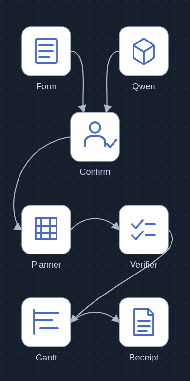
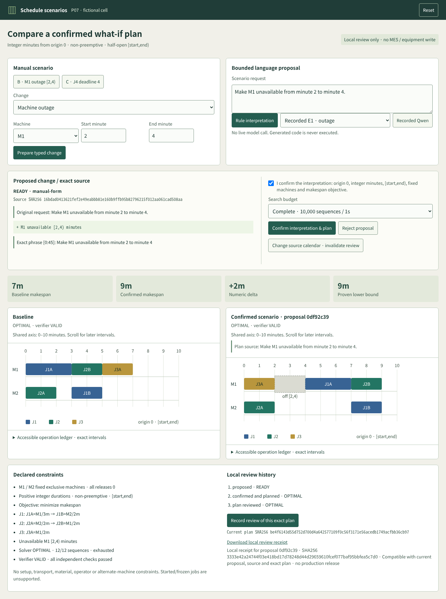
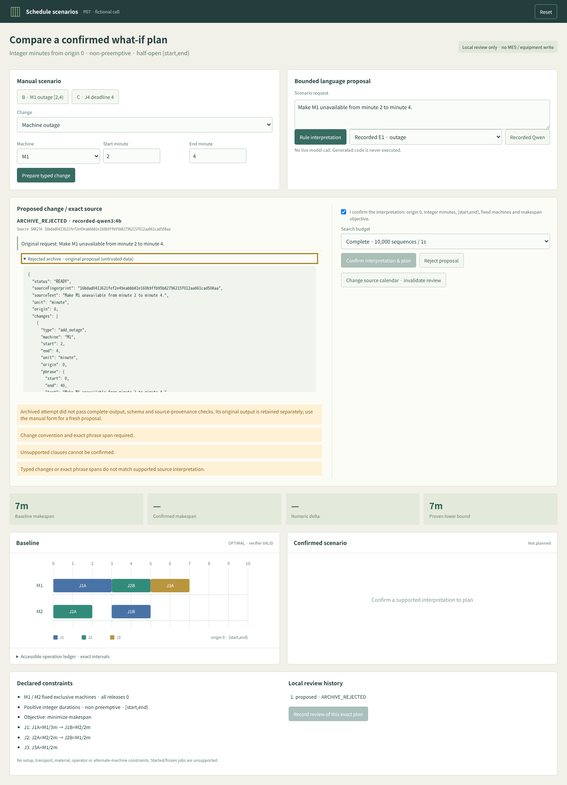

# Production schedule scenario review



[](https://github.com/Kimhyuntae9665/production-schedule-scenario-review/actions/workflows/ci.yml)

[Editable architecture SVG](docs/architecture.svg) · [Asset provenance](docs/asset-provenance.md)

A small production-planning review desk for a **fictional two-machine cell**. A bounded language proposal or manual form prepares a typed change. A person confirms its meaning and half-open minute convention; an actually executed exact planner then produces a schedule. An independently implemented verifier checks the operations. A separate human action records review of the exact proposal and exact plan.

The interface uses compact controls, a proposed-change diff, two Gantts on the **same relative-minute scale**, explicit downtime bands, numeric deltas, solver proof state, independent checks and a review history. Original operations are accessible in a keyboard-focusable SVG and an operation ledger. The form works without any model service.



[Original CPU-only browser demonstration MP4](artifacts/media/scenario-review.mp4) · [Current 390px UNKNOWN screenshot](artifacts/media/readable-unknown-390.png) · [Browser checks](artifacts/browser-checks.json)

## Run locally

Node 18 or later; no npm packages, solver installation, vector database or calendar widget is required.

```sh
npm test
npm start
```

Open `http://127.0.0.1:5077`. State is in memory and resets when the process restarts. The optional Python client requires Linux and the existing local Ollama runtime; it is not part of normal UI use. [Runbook](docs/runbook.md) describes its shared lease and timeout barrier. CPU tests mock inference and make no model requests.

## Original scheduling slice and actual outcomes

All releases are 0, the origin is 0, units are integer minutes, machines M1/M2 are fixed and exclusive, operations have positive durations and cannot be preempted, and intervals are **[start,end)**. The objective minimizes makespan. There are no setup, transport, material, operator or alternate-machine constraints. Existing started/frozen jobs are unsupported.

| Scenario | Change | Actual solver / verifier | Makespan | Proof |
|---|---|---|---:|---|
| A | J1A M1/3 → J1B M2/2; J2A M2/2 → J2B M1/2; J3A M1/2 | OPTIMAL / VALID | 7 | M1 workload 7; all 12 machine-order combinations examined |
| B | M1 unavailable [2,4) | OPTIMAL / VALID | 9 | Workload plus calendar lower bound 9; all 12 combinations examined |
| C | J4A M2/1 → J4B M1/1; explicit hard completion deadline 4 | OPTIMAL / VALID | 8 | M1 workload 8; all 144 combinations examined |
| A, horizon 6 | Completion required within 6 | INFEASIBLE / NOT_RUN | — | M1 load 7 exceeds horizon |
| A, one sequence | Deliberately incomplete search | UNKNOWN / VALID | 11 incumbent | Feasible incumbent is not an optimum proof |
| A, zero time budget | Deliberately incomplete search | UNKNOWN / NOT_RUN | — | No incumbent; no infeasibility claim |

[Six actual planner invocations](artifacts/planner-executions.json) are produced by `node plan-evidence.mjs`; they do not read the gold at runtime. [Frozen handwritten mathematical gold](gold.json) was committed before model prompts at `a188c88`. Another valid seven-minute base schedule is accepted; the UI need not duplicate the gold's particular machine order.

`planner.mjs` enumerates the operation order on each machine, combines those orders with job-precedence edges, rejects cycles, and places each operation at its earliest calendar-compatible time. Under the declared fixed-machine assumptions, every feasible schedule induces a machine order and moving operations earlier for that order cannot harm makespan or upper completion deadlines. Exhausting all such orders therefore establishes completeness. The search budget is at most 10,000 combinations and 1 second by default, with at most 12 operations. Incomplete enumeration returns UNKNOWN even with a feasible incumbent. Invalid schema, missing duration and unknown machine return INVALID rather than INFEASIBLE.

`verifier.mjs` does not import the planner or gold. It recomputes exactly-once required-operation coverage, IDs, durations, fixed-machine assignment, releases, job precedence, machine overlaps, downtime, hard deadlines and reported makespan. Omitting J3 fails even if the remaining operations do not overlap. Solver termination, independent feasibility checks and human review are separate states.

## Interpretation and decision boundaries

Only typed `add_outage` and explicit `add_job` J4 changes are allowed. Each carries exact phrase spans, IDs, unit/origin and the source scenario fingerprint. The bounded rule parser is intentionally a small grammar, not general natural-language understanding. It rechecks model proposals against exact explicit facts in that grammar. Unsupported residue cannot silently disappear.

- “Urgent” alone has no deadline. Missing duration/deadline requires clarification.
- Unknown machine aliases, ambiguous “don't move J2”, color-order clauses, lateness objectives, supplier instructions, generated code and started/frozen jobs cannot be confirmed.
- Exact multiples of 60 seconds may convert to integer minutes; other seconds require clarification. Both endpoint units are checked independently.
- Confirmation binds the displayed proposal ID, full proposal hash and source fingerprint. Replacements or calendar changes return stale inspection errors.
- The review action binds the confirmed proposal and exact plan fingerprint, including solver proof and verifier result. A new search budget creates a distinct plan. Repeated review of an unchanged plan retains one receipt.
- A pending replacement proposal leaves the previous plan visible with its exact confirmed source and proposal ID; it is explicitly labeled previous. Its receipt becomes historical until the inspected proposal and exact plan match. Calendar changes also invalidate compatibility. Downloaded receipts carry current compatibility separately without changing the original receipt hash.
- Archived malformed, incomplete or provenance-mismatched model attempts cannot be confirmed. Raw evidence is retained separately from the display-safe rejection state.

No model executes tests, a generated program, SQL or MIP. No MES write, production release, equipment control, certification, factory-throughput or ROI claim is made. A local review receipt is a demo record, not an authenticated enterprise approval or tamper-proof audit service.

## Model comparison

The original 12 interpretation cases were frozen before prompting in [interpretation-cases.json](interpretation-cases.json), with 3 explicitly supported, 2 clarification and 7 unsupported requests. Development and evaluation are separate: **zero development model calls** and **12 evaluation calls** were executed. The one-at-a-time `qwen3:4b` calls used context 4,096, output 640, timeout 60 seconds, temperature 0 and seed 42. Evaluation input and source snapshots were committed at `a5d4fb1` before inference, binding implementation `7bc61d5`. Failed attempts and invalid JSON are retained; there are no silent retries or overwritten archives.

**Observed result: every Qwen response said READY; none was usable under the frozen validation gate.** All 12 HTTP requests completed with valid JSON, done acknowledgement and no timeout/truncation. There were no retries, repairs, additional demo inference calls or prompt tuning against these evaluation answers.

| Measure | Fixed Qwen run | Rule grammar | Explicit form |
|---|---:|---:|---:|
| Expected status label matched | 3/12 (25%) | 12/12 | Not a language classification task |
| False READY on 9 clarification/unsupported cases | 9/9 | 0/9 | Not applicable |
| Full validated READY proposals | 0/12 | 3/12 | 3/3 explicit supported inputs |
| Supported requests admitted | 0/3 | 3/3 | 3/3 |

The raw 3/12 figure is **status-only**, not three correct usable interpretations. E1 copied the outage values but returned a phrase end offset of 40 inconsistent with its quoted source. E3 invented a deadline of 1 for “urgent” and duplicated J4. E6 converted seconds but retained a READY status together with unresolved unit issues. All original outputs remain in [the 12 attempt files](artifacts/model-attempts); [evaluation](artifacts/model-evaluation.json) preserves request identity, source hashes, raw versus guarded scores and rejection reasons. No generated field was automatically repaired or accepted.

Zero unsafe admissions here results from **rejecting every model proposal**, including all three supported requests. It does not establish general robustness, useful model recall or general model accuracy. The [executed CPU baseline](artifacts/baseline-executions.json) uses a hand-authored grammar aligned with this original tiny fixture and shares validation; it is not independent natural-language generalization. The form comparison covers three explicitly entered typed inputs only. Interpretation quality, planner correctness and any factory performance are separate questions.

Provider-reported totals were 7,019 prompt tokens and 3,864 output tokens; the largest individual counts were 602/545. Client-measured per-request elapsed time was 2.81–8.54 seconds, including local transport/loading. These are local inference observations, not factory performance or a configured timeout presented as a measurement. [Runtime metadata](artifacts/runtime-provenance.json) reports Ollama 0.17.7 and the installed Qwen3 4.0B Q4_K_M digest observed after the run; archived requests identify the model tag, not per-request immutable weight attestation.



[Recorded-output review MP4](artifacts/media/recorded-model-review.mp4) · [Model browser checks](artifacts/model-browser-checks.json) · [Model rejection at 390px](artifacts/media/model-mobile-390.png). This is an actual browser replay of the frozen model outputs, with **0 model calls during recording**. The script checks rejected E1/E3/E10/E6, keeps confirmation disabled, preserves original source text, and then demonstrates an explicit manual fallback producing 9 minutes with a VALID verifier. The automated demo creates no human approval or model review receipt. Earlier screenshots and the CPU-only demonstration remain unchanged.

[Batch-completion evidence](artifacts/model-runtime-completion.json) verifies 12 done responses, the free shared lock and absent timeout marker. P07 released its GPU lease after that check; no further inference is scheduled. A model interpretation score never measures planner correctness or production performance.

## Verification and scope

`npm test` currently passes **35 Node tests**. On Linux, `python3 -m unittest discover -s test -p 'test_model_client.py' -v` passes **6 CPU lease/timeout tests**. Browser checks cover proposal-before-planning, controlled delayed loading, 7→9 outage, explicit deadline 8, repeated receipts, stale calendars, rejection preserving baseline, UNKNOWN feasible incumbents, INFEASIBLE horizon, keyboard navigation and a 390px viewport with no viewport shrinking. The architecture was inspected at both 360px and 390px; actual published GitHub loading also passed at 360px, 390px and desktop ([checks](artifacts/published-checks.json)).

[CPU UI regressions](artifacts/ui-boundary-fixed.json) separately reproduce and verify previous-plan binding and a deadline at minute 30. Both Gantts include deadlines in the same shared horizon, preserve at least 38 pixels per minute, and scroll horizontally alongside the exact interval ledger. Current 390px browser checks measure meaningful text at least 14px; checked axis, metric and operation-label colors exceed the [4.5:1 normal-text contrast target](https://www.w3.org/WAI/WCAG22/Understanding/contrast-minimum.html). This is a focused readability check, not a complete accessibility audit. [Before evidence](artifacts/ui-boundary-before.json), [previous-plan repair](artifacts/media/plan-binding-fixed.png), and [deadline marker repair](artifacts/media/deadline-axis-fixed.png) remain available.

[Published model-media checks](artifacts/published-model-checks.json) bind the actual repaired publication at `678f762` and verify loaded architecture and recorded-output screenshots at 360px, 390px and desktop. The final evidence commit preserves the same implementation and media bytes.

Read [independent review notes](docs/review.md), [enterprise source chronology](docs/enterprise-context.md), and [media provenance](docs/asset-provenance.md). The fixtures, allowlist, planner and verifier are an original smaller design. They are not customer data or a reconstruction of private vendor architecture. MIT license covers this original implementation and glyphs.
