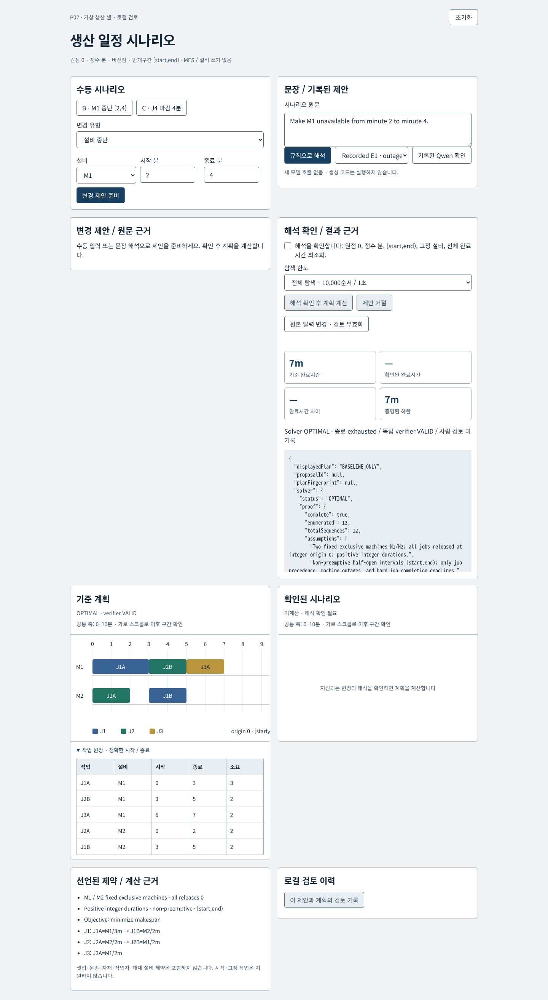
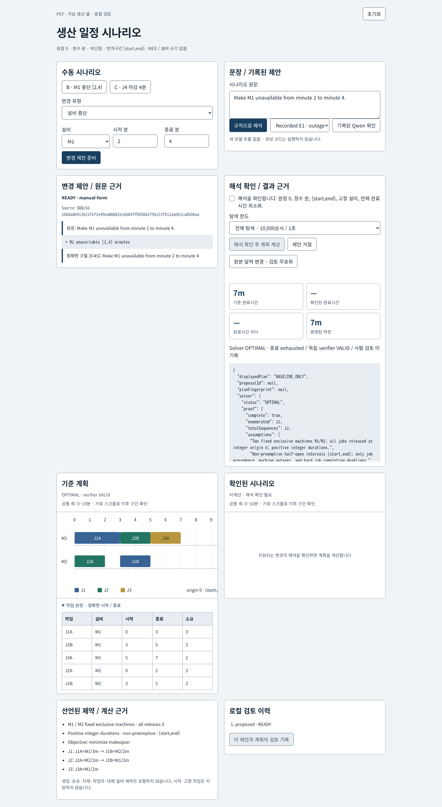
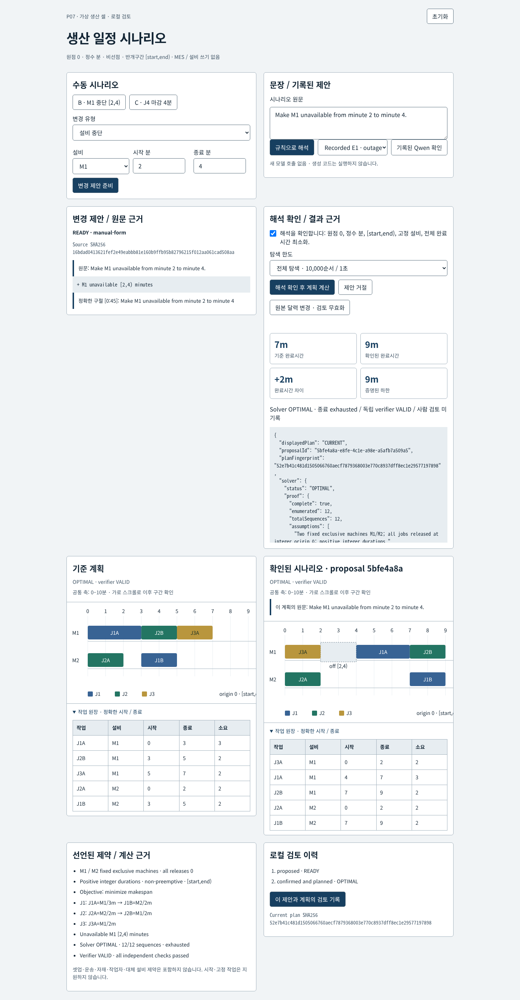
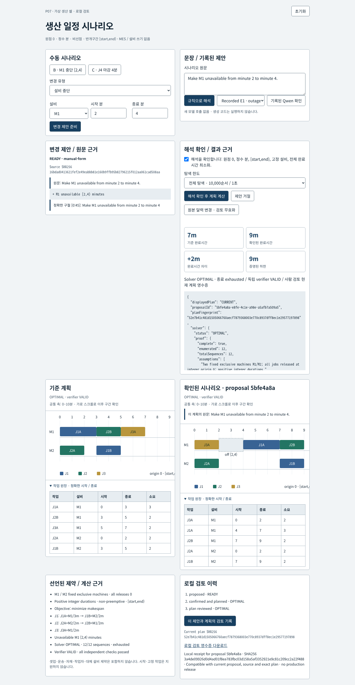
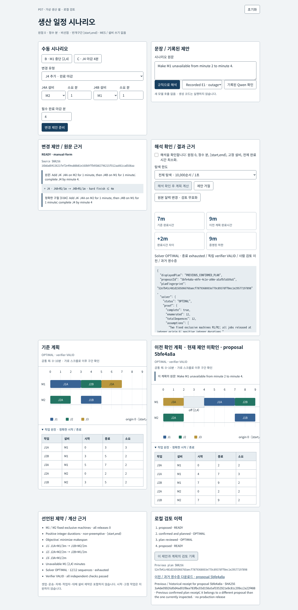
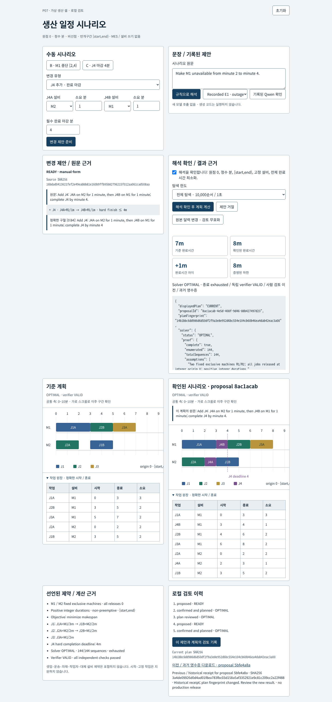
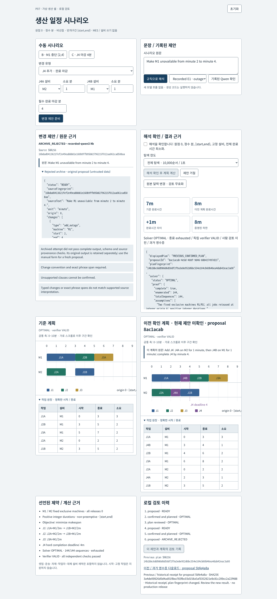
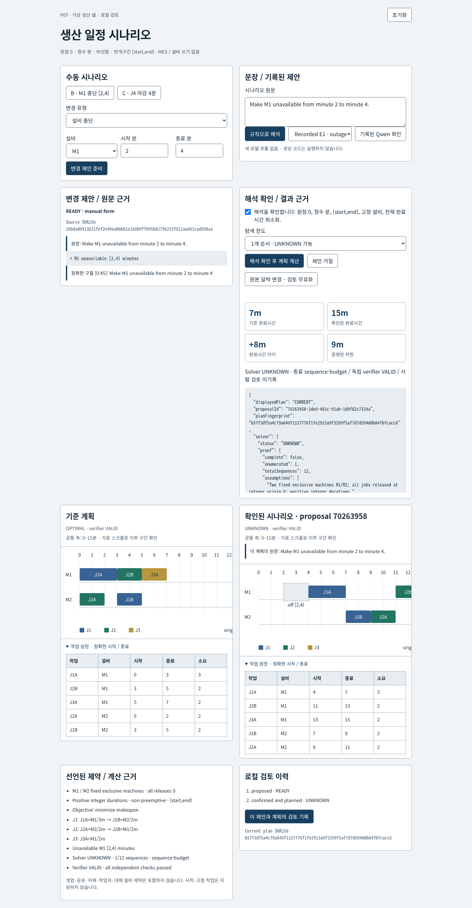
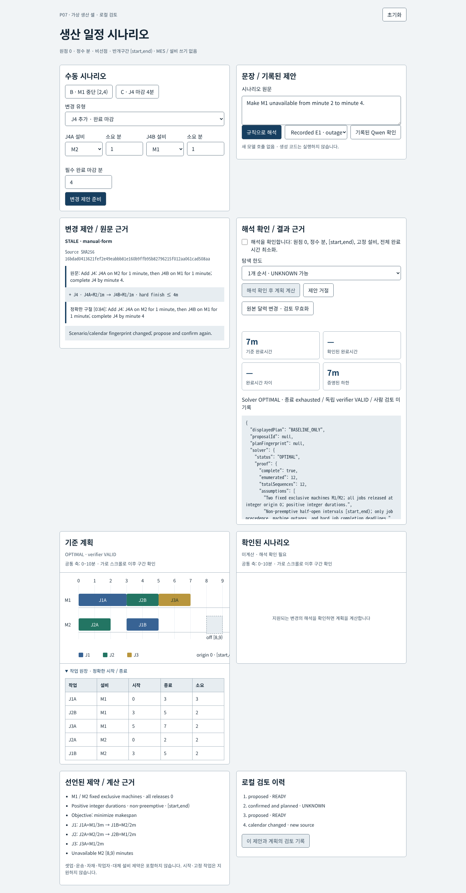
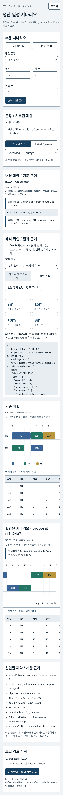

# Production schedule CPU calculation and scenario review

[](https://github.com/Kimhyuntae9665/production-schedule-scenario-review/actions/workflows/ci.yml)

[Editable architecture SVG](docs/architecture.svg) · [Asset provenance](docs/asset-provenance.md)

A local **CPU scheduling utility for a bounded two-machine cell**. Import your own baseline JSON, inspect its source hash and revision, then prepare an explicit change. Human confirmation binds the proposal and source before the deterministic planner calculates the changed schedule. An independent verifier checks the actual intervals; a separate action records review of that exact plan. This is a what-if calculation tool, with no autonomous AI scheduling or factory control.

**The optional Qwen archive produced 0/12 usable proposals and is a failed experiment, not the working scheduling engine.** No new model evaluation has been run. User input stays in the local Node process on CPU and is never sent to a model. Original gold, evaluation cases, model attempts and model evaluation remain unchanged.

## Use your own baseline

Paste JSON into **사용자 기준 일정 JSON**, then choose **기준 일정 적용·계산**. The initial textarea contains the current source and can be edited. **현재 원본 JSON 불러오기** replaces the editor contents with the current applied source. Import replaces the active baseline, clears its proposal and changed plan, and keeps earlier review receipts and events as historical records. **가상 예제 복원** restores synthetic A and also preserves history. State lives in memory until server restart; the source hash is a consistency guard, not durable storage or authentication.

The baseline schema accepts exactly M1/M2, origin 0, minute units, makespan objective, release 0, unique job IDs and globally unique operation IDs. Each job is a nonempty ordered operation chain. Limits are 12 total operations, 12 jobs, 32 outages, integer durations 1–1440 minutes, and integer outage endpoints/deadlines 0–1440 minutes. Unknown fields are rejected. IDs start with an ASCII letter and contain at most 40 letters, digits, underscores or hyphens. Revision is a nonnegative safe integer or a nonempty string of up to 40 characters; import stores the supplied revision separately and assigns a new server-owned source revision. Request bodies are at most 16,000 bytes, depth 8 and 1,000 values. Invalid input is rejected before calculation and leaves the existing source intact.

For example, this baseline uses different IDs, two jobs and a three-operation chain, rather than the original A/B/C fixtures:

```json
{
  "id": "LOCAL_CELL", "revision": "customer-v2",
  "origin": 0, "unit": "minute", "objective": "makespan",
  "machines": ["M1", "M2"],
  "jobs": [
    {"id": "ORDER_A", "release": 0, "deadline": 20, "operations": [
      {"id": "CUT_A", "machine": "M1", "duration": 3},
      {"id": "CHECK_A", "machine": "M2", "duration": 2},
      {"id": "FINISH_A", "machine": "M1", "duration": 1}
    ]},
    {"id": "ORDER_B", "release": 0, "operations": [
      {"id": "CHECK_B", "machine": "M2", "duration": 2},
      {"id": "CUT_B", "machine": "M1", "duration": 4}
    ]}
  ],
  "outages": [{"machine": "M2", "start": 4, "end": 5}]
}
```

CPU regression tests calculate **OPTIMAL / VALID, 8 minutes** for this input. After confirmed M1 downtime [2,4), the result is **OPTIMAL / VALID, 12 minutes**. These are deterministic calculation results on a new supported shape; they do not measure model accuracy or real factory performance. Larger search spaces may return UNKNOWN within the unchanged 10,000-order / 1-second budget. An imported impossible deadline returns INFEASIBLE / NOT_RUN; a feasible verifier label is never invented when there is no schedule.

The explicit job-change form now accepts your own new job and two operation IDs. The supported English grammar is `Add EXTRA: FIRST on M2 for 2 minutes, then LAST on M1 for 1 minute; complete EXTRA by minute 15.` Both steps and an explicit matching completion deadline are required. Change-form durations remain 1–10 minutes, outage and change deadline limits remain 30 minutes. Other baseline shapes can be imported directly; unsupported language still requires clarification. Duplicate IDs or exceeding the total operation limit cannot become READY. Separate [CPU input/grammar regressions](test/user-baseline.test.mjs) cover new shapes, exact spans, duplicate IDs, unsupported residue, invalid/deep/large input and stale two-client requests; the frozen model cases are untouched.

For the local API, read `/api/state`, then POST `/api/import` with `{"sourceFingerprint":"<current SHA256>","baseline":{...}}`. Propose, calendar-change and reset actions also require that current source fingerprint. Import or reset increments the source revision even for identical input bytes, so stale propose/import/confirm/review requests return 409. Confirmation additionally binds proposal ID/hash; review also binds the exact plan fingerprint. A historical receipt retains its original hash and is explicitly incompatible after source changes. There is no file upload, database write, model request or factory connection.

## Historical UI screenshots (before user import)

아래 10개는 이전 UI의 실제 브라우저 화면을 보존한 자료입니다. 새 사용자 JSON 입력 화면을 증명하는 자료는 아닙니다. 두 Gantt와 정확한 작업 원장의 기존 계산 흐름을 보여 줍니다.



기준 7분 계획을 표시하고 확인 전 변경 계획은 계산하지 않습니다.



변경 제안의 원문·구절·출처 지문과 정확한 시작/종료 원장을 확인합니다.



M1 중단 [2,4) 후 7→9분 결과를 같은 Gantt 축에서 비교합니다.



계산·독립 검증과 별도로 사람 검토를 기록합니다. 같은 계획의 반복 검토는 영수증을 늘리지 않습니다.



새 J4 제안을 준비해도 이전 9분 계획·원문은 보존되며 영수증은 과거 상태로 표시됩니다.



명시된 J4 마감 4분을 만족하는 C 시나리오의 전체 완료시간은 8분입니다.



원본 Qwen E1 기록은 ARCHIVE_REJECTED입니다. 원본 제안을 표시하고 확인은 비활성화합니다.



1개 순서 탐색의 UNKNOWN과 실행 가능 incumbent의 VALID 검증을 구분합니다. 최적성은 주장하지 않습니다.



달력 변경은 기존 해석을 STALE로 만들고 확인을 막습니다. 오래된 클라이언트의 확인도 409로 거절됩니다.



390px에서 제목은 한 줄, 의미 있는 글자는 최소 14px이며 Gantt는 축을 축소하지 않고 가로 스크롤합니다.

[Historical UI refit browser video](artifacts/ui-refit/scenario-review-current.mp4) · [Historical browser checks](artifacts/ui-refit/browser-checks.json) · [Historical asset SHA256 / bytes and preserved-source checks](artifacts/ui-refit/provenance.json)

That historical video records the automated desktop browser flow above, including a deadline-30 scrolling check. Mobile is a separate screenshot, not footage in that video. There is no narration, generated solver log, new model invocation or GPU inference. The prior implementation's 35 Node tests and 6 Python CPU tests passed at capture time; those saved checks do not certify this later import feature.

All images/videos under `artifacts/media/` and their old publication/readability reports are **historical evidence from the prior UI**, retained unchanged. [Historical CPU video](artifacts/media/scenario-review.mp4) and [historical model replay video](artifacts/media/recorded-model-review.mp4) describe that prior presentation.
## Run locally

Node 18 or later; no npm packages, solver installation, vector database or calendar widget is required.

```sh
npm test
npm start
```

Open `http://127.0.0.1:5077`. State is in memory and resets when the process restarts. The optional Python client requires Linux and the existing local Ollama runtime; it is not part of normal UI use. [Runbook](docs/runbook.md) describes its shared lease and timeout barrier. CPU tests mock inference and make no model requests.

## Original scheduling slice and actual outcomes

All releases are 0, the origin is 0, units are integer minutes, machines M1/M2 are fixed and exclusive, operations have positive durations and cannot be preempted, and intervals are **[start,end)**. The objective minimizes makespan. There are no setup, transport, material, operator or alternate-machine constraints. Existing started/frozen jobs are unsupported.

| Scenario | Change | Actual solver / verifier | Makespan | Proof |
|---|---|---|---:|---|
| A | J1A M1/3 → J1B M2/2; J2A M2/2 → J2B M1/2; J3A M1/2 | OPTIMAL / VALID | 7 | M1 workload 7; all 12 machine-order combinations examined |
| B | M1 unavailable [2,4) | OPTIMAL / VALID | 9 | Workload plus calendar lower bound 9; all 12 combinations examined |
| C | J4A M2/1 → J4B M1/1; explicit hard completion deadline 4 | OPTIMAL / VALID | 8 | M1 workload 8; all 144 combinations examined |
| A, horizon 6 | Completion required within 6 | INFEASIBLE / NOT_RUN | — | M1 load 7 exceeds horizon |
| A, one sequence | Deliberately incomplete search | UNKNOWN / VALID | 11 incumbent | Feasible incumbent is not an optimum proof |
| A, zero time budget | Deliberately incomplete search | UNKNOWN / NOT_RUN | — | No incumbent; no infeasibility claim |

[Six actual planner invocations](artifacts/planner-executions.json) are produced by `node plan-evidence.mjs`; they do not read the gold at runtime. [Frozen handwritten mathematical gold](gold.json) was committed before model prompts at `a188c88`. Another valid seven-minute base schedule is accepted; the UI need not duplicate the gold's particular machine order.

`planner.mjs` enumerates the operation order on each machine, combines those orders with job-precedence edges, rejects cycles, and places each operation at its earliest calendar-compatible time. Under the declared fixed-machine assumptions, every feasible schedule induces a machine order and moving operations earlier for that order cannot harm makespan or upper completion deadlines. Exhausting all such orders therefore establishes completeness. The search budget is at most 10,000 combinations and 1 second by default, with at most 12 operations. Incomplete enumeration returns UNKNOWN even with a feasible incumbent. Invalid schema, missing duration and unknown machine return INVALID rather than INFEASIBLE.

`verifier.mjs` does not import the planner or gold. It recomputes exactly-once required-operation coverage, IDs, durations, fixed-machine assignment, releases, job precedence, machine overlaps, downtime, hard deadlines and reported makespan. Omitting J3 fails even if the remaining operations do not overlap. Solver termination, independent feasibility checks and human review are separate states.

## Interpretation and decision boundaries

Only typed `add_outage` and explicit two-operation `add_job` changes are allowed. Job and operation IDs are user-supplied; the original J4 form remains a preset. Each carries exact phrase spans, IDs, unit/origin and the source scenario fingerprint. The bounded rule parser is intentionally a small grammar, not general natural-language understanding. It rechecks model proposals against exact explicit facts in that grammar. Unsupported residue cannot silently disappear.

- “Urgent” alone has no deadline. Missing duration/deadline requires clarification.
- Unknown machine aliases, ambiguous “don't move J2”, color-order clauses, lateness objectives, supplier instructions, generated code and started/frozen jobs cannot be confirmed.
- Exact multiples of 60 seconds may convert to integer minutes; other seconds require clarification. Both endpoint units are checked independently.
- Confirmation binds the displayed proposal ID, full proposal hash and source fingerprint. Replacements or calendar changes return stale inspection errors.
- The review action binds the confirmed proposal and exact plan fingerprint, including solver proof and verifier result. A new search budget creates a distinct plan. Repeated review of an unchanged plan retains one receipt.
- A pending replacement proposal leaves the previous plan visible with its exact confirmed source and proposal ID; it is explicitly labeled previous. Its receipt becomes historical until the inspected proposal and exact plan match. Calendar changes also invalidate compatibility. Downloaded receipts carry current compatibility separately without changing the original receipt hash.
- Archived malformed, incomplete or provenance-mismatched model attempts cannot be confirmed. Raw evidence is retained separately from the display-safe rejection state.

No model executes tests, a generated program, SQL or MIP. No MES write, production release, equipment control, certification, factory-throughput or ROI claim is made. A local review receipt is a demo record, not an authenticated enterprise approval or tamper-proof audit service.

## Model comparison

The original 12 interpretation cases were frozen before prompting in [interpretation-cases.json](interpretation-cases.json), with 3 explicitly supported, 2 clarification and 7 unsupported requests. Development and evaluation are separate: **zero development model calls** and **12 evaluation calls** were executed. The one-at-a-time `qwen3:4b` calls used context 4,096, output 640, timeout 60 seconds, temperature 0 and seed 42. Evaluation input and source snapshots were committed at `a5d4fb1` before inference, binding implementation `7bc61d5`. Failed attempts and invalid JSON are retained; there are no silent retries or overwritten archives.

**Observed result: every Qwen response said READY; none was usable under the frozen validation gate.** All 12 HTTP requests completed with valid JSON, done acknowledgement and no timeout/truncation. There were no retries, repairs, additional demo inference calls or prompt tuning against these evaluation answers.

| Measure | Fixed Qwen run | Rule grammar | Explicit form |
|---|---:|---:|---:|
| Expected status label matched | 3/12 (25%) | 12/12 | Not a language classification task |
| False READY on 9 clarification/unsupported cases | 9/9 | 0/9 | Not applicable |
| Full validated READY proposals | 0/12 | 3/12 | 3/3 explicit supported inputs |
| Supported requests admitted | 0/3 | 3/3 | 3/3 |

The raw 3/12 figure is **status-only**, not three correct usable interpretations. E1 copied the outage values but returned a phrase end offset of 40 inconsistent with its quoted source. E3 invented a deadline of 1 for “urgent” and duplicated J4. E6 converted seconds but retained a READY status together with unresolved unit issues. All original outputs remain in [the 12 attempt files](artifacts/model-attempts); [evaluation](artifacts/model-evaluation.json) preserves request identity, source hashes, raw versus guarded scores and rejection reasons. No generated field was automatically repaired or accepted.

Zero unsafe admissions here results from **rejecting every model proposal**, including all three supported requests. It does not establish general robustness, useful model recall or general model accuracy. The [executed CPU baseline](artifacts/baseline-executions.json) uses a hand-authored grammar aligned with this original tiny fixture and shares validation; it is not independent natural-language generalization. The form comparison covers three explicitly entered typed inputs only. Interpretation quality, planner correctness and any factory performance are separate questions.

Provider-reported totals were 7,019 prompt tokens and 3,864 output tokens; the largest individual counts were 602/545. Client-measured per-request elapsed time was 2.81–8.54 seconds, including local transport/loading. These are local inference observations, not factory performance or a configured timeout presented as a measurement. [Runtime metadata](artifacts/runtime-provenance.json) reports Ollama 0.17.7 and the installed Qwen3 4.0B Q4_K_M digest observed after the run; archived requests identify the model tag, not per-request immutable weight attestation.


[Recorded-output review MP4](artifacts/media/recorded-model-review.mp4) · [Model browser checks](artifacts/model-browser-checks.json) · [Model rejection at 390px](artifacts/media/model-mobile-390.png). This is an actual browser replay of the frozen model outputs, with **0 model calls during recording**. The script checks rejected E1/E3/E10/E6, keeps confirmation disabled, preserves original source text, and then demonstrates an explicit manual fallback producing 9 minutes with a VALID verifier. The automated demo creates no human approval or model review receipt. Earlier screenshots and the CPU-only demonstration remain unchanged.

[Batch-completion evidence](artifacts/model-runtime-completion.json) verifies 12 done responses, the free shared lock and absent timeout marker. P07 released its GPU lease after that check; no further inference is scheduled. A model interpretation score never measures planner correctness or production performance.

## Verification and scope

`npm test` covers **39 Node tests**, including the separate user-input regressions above. The original Linux command `python3 -m unittest discover -s test -p 'test_model_client.py' -v` covered 6 CPU lease/timeout tests in the archived run. Historical browser checks cover proposal-before-planning, controlled delayed loading, 7→9 outage, explicit deadline 8, repeated receipts, stale calendars, rejection preserving baseline, UNKNOWN feasible incumbents, INFEASIBLE horizon, keyboard navigation and a 390px viewport. Historical published checks and architecture inspection apply to their saved revisions ([checks](artifacts/published-checks.json)), not the later import feature.

[CPU UI regressions](artifacts/ui-boundary-fixed.json) separately reproduce and verify previous-plan binding and a deadline at minute 30. Both Gantts include deadlines in the same shared horizon, preserve at least 38 pixels per minute, and scroll horizontally alongside the exact interval ledger. Current 390px browser checks measure meaningful text at least 14px; checked axis, metric and operation-label colors exceed the [4.5:1 normal-text contrast target](https://www.w3.org/WAI/WCAG22/Understanding/contrast-minimum.html). This is a focused readability check, not a complete accessibility audit. [Before evidence](artifacts/ui-boundary-before.json), [previous-plan repair](artifacts/media/plan-binding-fixed.png), and [deadline marker repair](artifacts/media/deadline-axis-fixed.png) remain available.

[Published model-media checks](artifacts/published-model-checks.json) bind the actual repaired publication at `678f762` and verify loaded architecture and recorded-output screenshots at 360px, 390px and desktop. The final evidence commit preserves the same implementation and media bytes.

Read [independent review notes](docs/review.md), [enterprise source chronology](docs/enterprise-context.md), and [media provenance](docs/asset-provenance.md). The fixtures, allowlist, planner and verifier are an original smaller design. They are not customer data or a reconstruction of private vendor architecture. MIT license covers this original implementation and glyphs.
